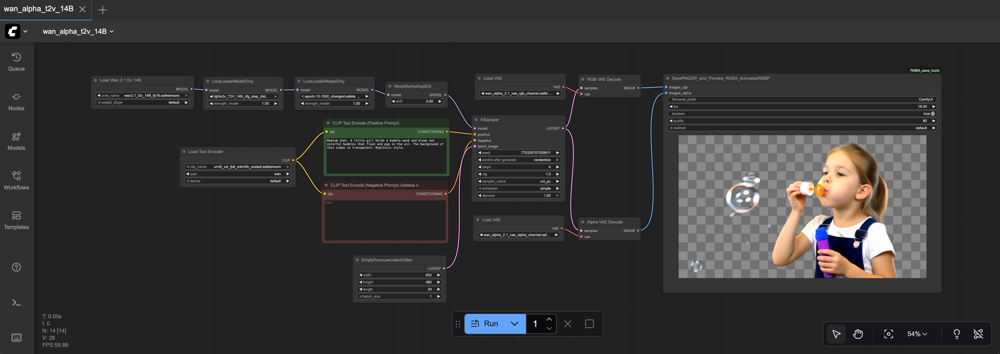

<div align="center">

  <h1>
    Wan-Alpha for Replicate
  </h1>

  <h3>Wan-Alpha: High-Quality Text-to-Video Generation with Alpha Channel - Replicate Deployment</h3>

  <p><strong>Fork of the original Wan-Alpha with WebM/WebP export and Replicate API support</strong></p>

[](https://arxiv.org/pdf/2509.24979)
[](https://donghaotian123.github.io/Wan-Alpha/)
[](https://huggingface.co/htdong/Wan-Alpha)
[](https://github.com/WeChatCV/Wan-Alpha)

</div>

---

## 🆕 What's New in This Fork?

This repository adapts the original [Wan-Alpha](https://github.com/WeChatCV/Wan-Alpha) for deployment on Replicate with enhanced output formats and API accessibility.

### Key Changes:

**✨ New Output Formats:**
- 🎬 **WebM (VP9)** - Animated video with alpha channel support
- 🖼️ **WebP** - Animated image format with transparency
- ❌ Removed MP4 (doesn't support transparency)

**📐 Custom Resolutions:**
- Added `512x512 (fit vertical)` - Renders at 480x832, fits to 512x512 with transparent padding
- Added `512x512 (fit horizontal)` - Renders at 832x480, fits to 512x512 with transparent padding
- Maintains original 4 supported resolutions (720x1280, 1280x720, 480x832, 832x480)

**⚙️ Enhanced Controls:**
- **FPS Control**: Adjustable frame rate (1-60 fps)
- **Quality Control**: Output quality control (1-100)
- **FFmpeg Integration**: Professional video encoding with transparency preservation

**☁️ Replicate Deployment:**
- `cog.yaml` configuration for Replicate
- `predict.py` API interface
- Automated weight downloading during build (~32-52GB)
- Single-file output (WebM or WebP)

**🔧 Technical Improvements:**
- Removed deprecated `prefetch_weights.py` script
- Inline weight downloads in `cog.yaml` for build-time caching
- Proper error handling and cleanup
- Alpha channel preservation throughout pipeline

---


>Qualitative results of video generation using **Wan-Alpha**. Our model successfully generates various scenes with accurate and clearly rendered transparency. Notably, it can synthesize diverse semi-transparent objects, glowing effects, and fine-grained details such as hair.

---

### 🔥 News
* **[2025.09.30]** Our technical report is available on [arXiv](https://arxiv.org/pdf/2509.24979).
* **[2025.09.30]** Released Wan-Alpha v1.0, the Wan2.1-14B-T2V–adapted weights and inference code are now open-sourced.

---

### 🌟 Showcase

##### Text-to-Video Generation with Alpha Channel

<!-- | Prompt | Preview Video | Alpha Video |
| :---: | :---: | :---: |
| "Medium shot. A little girl holds a bubble wand and blows out colorful bubbles that float and pop in the air. The background of this video is transparent. Realistic style." |
  <div style="display: flex; gap: 10px;">
    
  </div> |
  <div style="display: flex; gap: 10px;">
    
  </div> | -->
| Prompt | Preview Video | Alpha Video |
| :---: | :---: | :---: |
| "Medium shot. A little girl holds a bubble wand and blows out colorful bubbles that float and pop in the air. The background of this video is transparent. Realistic style." |  |  |

##### For more results, please visit [Our Website](https://donghaotian123.github.io/Wan-Alpha/)

### 🚀 Quick Start

##### 1. Environment Setup
```bash
# Clone the project repository
git clone https://github.com/WeChatCV/Wan-Alpha.git
cd Wan-Alpha

# Create and activate Conda environment
conda create -n Wan-Alpha python=3.11 -y
conda activate Wan-Alpha

# Install dependencies
pip install -r requirements.txt
```

##### 2. Model Download
Download [Wan2.1-T2V-14B](https://huggingface.co/Wan-AI/Wan2.1-T2V-14B)

Download [Lightx2v-T2V-14B](https://huggingface.co/Kijai/WanVideo_comfy/blob/main/Lightx2v/lightx2v_T2V_14B_cfg_step_distill_v2_lora_rank64_bf16.safetensors)

Download [Wan-Alpha VAE](https://huggingface.co/htdong/Wan-Alpha)

### 🧪 Usage
You can test our model through:
```bash
torchrun --nproc_per_node=8 --master_port=29501 generate_dora_lightx2v.py --size 832*480\
         --ckpt_dir "path/to/your/Wan-2.1/Wan2.1-T2V-14B" \
         --dit_fsdp --t5_fsdp --ulysses_size 8 \
         --vae_lora_checkpoint "path/to/your/decoder.bin" \
         --lora_path "path/to/your/epoch-13-1500.safetensors" \
         --lightx2v_path "path/to/your/lightx2v_T2V_14B_cfg_step_distill_v2_lora_rank64_bf16.safetensors" \
         --sample_guide_scale 1.0 \
         --frame_num 81 \
         --sample_steps 4 \
         --lora_ratio 1.0 \
         --lora_prefix "" \
         --prompt_file ./data/prompt.txt \
         --output_dir ./output 
```
You can specify the weights of `Wan2.1-T2V-14B` with `--ckpt_dir`, `LightX2V-T2V-14B with` `--lightx2v_path`, `Wan-Alpha-VAE` with `--vae_lora_checkpoint`, and `Wan-Alpha-T2V` with `--lora_path`. Finally, you can find the rendered RGBA videos with a checkerboard background and PNG frames at `--output_dir`.

**Prompt Writing Tip:**  You need to specify that the background of the video is transparent, the visual style, the shot type (such as close-up, medium shot, wide shot, or extreme close-up), and a description of the main subject. Prompts support both Chinese and English input.

```bash
# An example of prompt.
This video has a transparent background. Close-up shot. A colorful parrot flying. Realistic style.
```

### 🔨 Official ComfyUI Version

Note: We have reorganized our models to ensure they can be easily loaded into ComfyUI. Please note that these models differ from the ones mentioned above.

1. Download models
- The Wan DiT base model: [wan2.1_t2v_14B_fp16.safetensors](https://huggingface.co/Comfy-Org/Wan_2.1_ComfyUI_repackaged/blob/main/split_files/diffusion_models/wan2.1_t2v_14B_fp16.safetensors)
- The Wan text encoder: [umt5_xxl_fp8_e4m3fn_scaled.safetensors](https://huggingface.co/Comfy-Org/Wan_2.1_ComfyUI_repackaged/blob/main/split_files/text_encoders/umt5_xxl_fp8_e4m3fn_scaled.safetensors)
- The LightX2V model: [lightx2v_T2V_14B_cfg_step_distill_v2_lora_rank64_bf16.safetensors](https://huggingface.co/Kijai/WanVideo_comfy/blob/main/Lightx2v/lightx2v_T2V_14B_cfg_step_distill_v2_lora_rank64_bf16.safetensors)
- Our RGBA Dora: [epoch-13-1500_changed.safetensors](https://huggingface.co/htdong/Wan-Alpha_ComfyUI/blob/main/epoch-13-1500_changed.safetensors)
- Our RGB VAE Decoder: [wan_alpha_2.1_vae_rgb_channel.safetensors.safetensors](https://huggingface.co/htdong/Wan-Alpha_ComfyUI/blob/main/wan_alpha_2.1_vae_rgb_channel.safetensors.safetensors)
- Our Alpha VAE Decoder: [wan_alpha_2.1_vae_alpha_channel.safetensors.safetensors](https://huggingface.co/htdong/Wan-Alpha_ComfyUI/blob/main/wan_alpha_2.1_vae_alpha_channel.safetensors.safetensors)

2. Copy the files into the `ComfyUI/models` folder and organize them as follows:

```
ComfyUI/models
├── diffusion_models
│   └── wan2.1_t2v_14B_fp16.safetensors
├── loras
│   ├── epoch-13-1500_changed.safetensors
│   └── lightx2v_T2V_14B_cfg_step_distill_v2_lora_rank64_bf16.safetensors
├── text_encoders
│   └── umt5_xxl_fp8_e4m3fn_scaled.safetensors
├── vae
│   ├── wan_alpha_2.1_vae_alpha_channel.safetensors.safetensors
│   └── wan_alpha_2.1_vae_rgb_channel.safetensors.safetensors
```

3. Install our custom RGBA video previewer and PNG frames zip packer. Copy the file [RGBA_save_tools.py](comfyui/RGBA_save_tools.py) into the `ComfyUI/custom_nodes` folder.

- Thanks to @mr-lab for an improved WebP version! You can find it in this [issue](https://github.com/WeChatCV/Wan-Alpha/issues/4).

4. Example workflow: [wan_alpha_t2v_14B.json](comfyui/wan_alpha_t2v_14B.json)




### 🚀 Deploy to Replicate

**Option 1: Via Replicate Web UI (Recommended)**

1. Push this repository to GitHub
2. Go to [replicate.com/create](https://replicate.com/create)
3. Click "Import from GitHub"
4. Select your repository
5. Replicate will automatically detect `cog.yaml` and build on their servers

**Option 2: Via Replicate CLI**

```bash
# Install Replicate
pip install replicate

# Create model from GitHub
replicate models create YOUR-USERNAME wan-alpha --github-url https://github.com/YOUR-USERNAME/wan-alpha-replicate
```

**Note:** The initial build takes 30-60+ minutes as it downloads ~32-52GB of model weights. This only happens once during deployment.

---

### 🤝 Acknowledgements

This project is built upon the following excellent open-source projects:
* [Wan-Alpha](https://github.com/WeChatCV/Wan-Alpha) (original implementation)
* [DiffSynth-Studio](https://github.com/modelscope/DiffSynth-Studio) (training/inference framework)
* [Wan2.1](https://github.com/Wan-Video/Wan2.1) (base video generation model)
* [LightX2V](https://github.com/ModelTC/LightX2V) (inference acceleration)
* [WanVideo_comfy](https://huggingface.co/Kijai/WanVideo_comfy) (inference acceleration)

We sincerely thank the authors and contributors of these projects.


### ✏ Citation

If you find our work helpful for your research, please consider citing our paper:

```bibtex
@misc{dong2025wanalpha,
      title={Wan-Alpha: High-Quality Text-to-Video Generation with Alpha Channel}, 
      author={Haotian Dong and Wenjing Wang and Chen Li and Di Lin},
      year={2025},
      eprint={2509.24979},
      archivePrefix={arXiv},
      primaryClass={cs.CV},
      url={https://arxiv.org/abs/2509.24979}, 
}
``` 

### 📬 Contact Us

If you have any questions or suggestions, feel free to reach out via [GitHub Issues](https://github.com/WeChatCV/Wan-Alpha/issues) . We look forward to your feedback!
